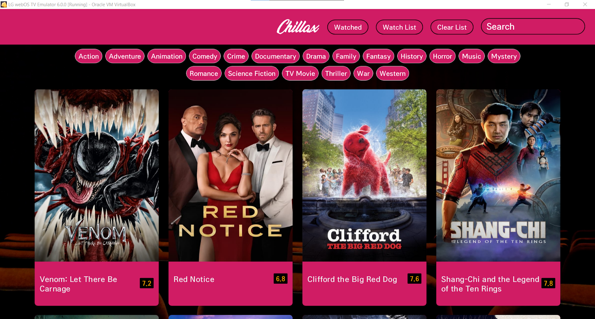
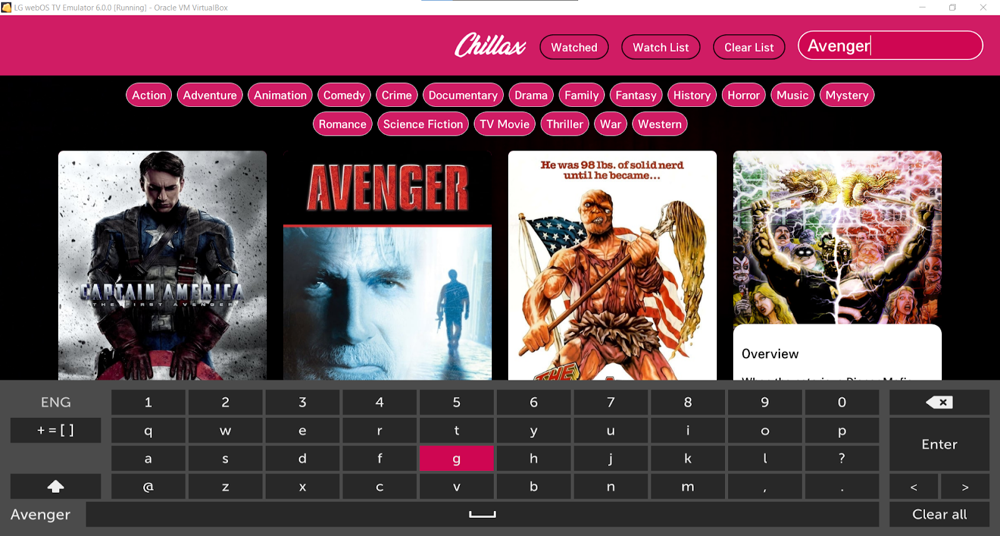
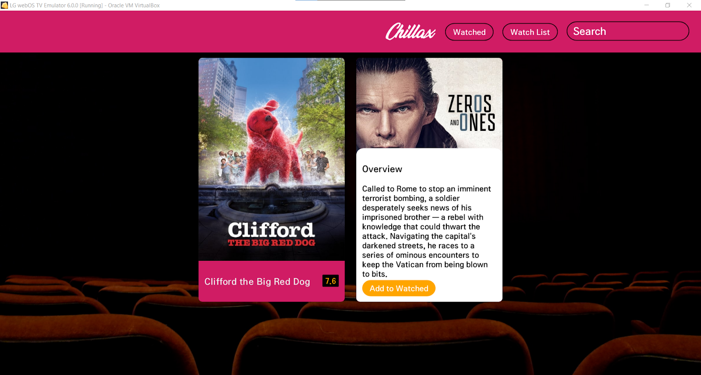
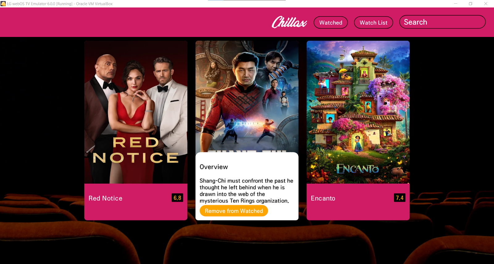

# Chillax
Chillax is an webOS TV app that lets users plan what to watch during the week. It’ll store the list of all the movies user wants to watch and watched.

### MainScreen
 

### SearchMovie:  
The Search bar or genre filter can be used to search for the movie to watch their trailer and add them to the watchlist/ watched sections. 
 

### Watch Movie Trailer fetched from Youtube  

### Watch List saved in DB8 Local Database  

### Watched List Saved in DB8 Local Database

